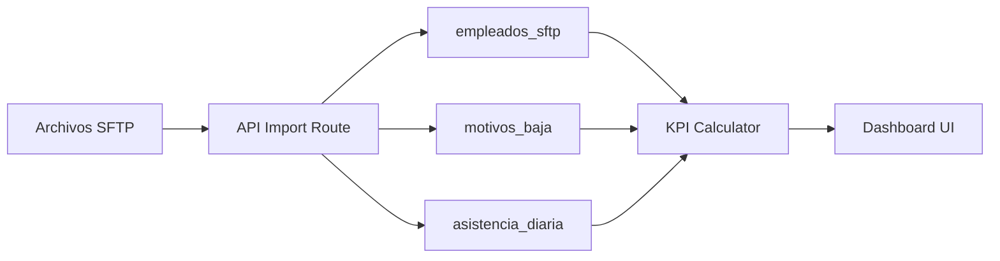

# 📊 ANÁLISIS EXHAUSTIVO - Dashboard MRM KPIs de RRHH

**Fecha de análisis**: 14 de Octubre, 2025
**Proyecto**: mrm_simple
**Supabase Project ID Real**: **vnyzjdtqruvofefexaue** (ACTIVE_HEALTHY)

---

## 🎯 DATOS REALES DEL PROYECTO

### Estado del Proyecto Supabase

**Proyecto Activo**: `mrm_simple` (ID: vnyzjdtqruvofefexaue)
- **Estado**: ACTIVE_HEALTHY ✅
- **Región**: us-east-1
- **Motor PostgreSQL**: 17.4.1.075
- **Fecha de creación**: 7 de Septiembre, 2025

### Datos Actuales de la Base de Datos

#### 📊 Empleados (empleados_sftp)
- **Total registros**: 996 empleados
- **Empleados activos**: 372
- **Empleados inactivos**: 624
- **Rango de fechas de ingreso**: 16 de Junio, 2001 → 10 de Septiembre, 2025
- **Total empresas**: 3
  1. MOTO REPUESTOS MONTERREY: 883 empleados (328 activos)
  2. MOTO TOTAL: 106 empleados (38 activos)
  3. REPUESTOS Y MOTOCICLETAS DEL NORTE: 7 empleados (6 activos)
- **Total áreas**: 32 áreas funcionales
- **Total departamentos**: 16 departamentos
- **Total puestos**: 177 puestos únicos

**Top 10 Áreas por Headcount**:
1. Desconocido: 471 (0 activos) - históricos sin área
2. Empaque: 61 (47 activos)
3. Surtido: 57 (35 activos)
4. Calidad: 56 (8 activos)
5. Supermoto: 48 (35 activos)
6. Recibo: 44 (28 activos)
7. Reabasto: 35 (29 activos)
8. RH: 28 (20 activos)
9. Logística: 21 (21 activos)
10. TIC: 19 (17 activos)

**Top 5 Departamentos**:
1. OPERACIONES Y LOGÍSTICA: 645 total (184 activos)
2. FILIALES: 110 total (43 activos)
3. RECURSOS HUMANOS: 47 total (26 activos)
4. ADMINISTRACIÓN Y FINANZAS: 38 total (21 activos)
5. VENTAS: 32 total (20 activos)

#### 🔴 Bajas (motivos_baja)
- **Total registros de bajas**: 602
- **Empleados únicos con baja**: 596
- **Rango de fechas**: 2 de Enero, 2023 → 15 de Septiembre, 2025
- **Tipos diferentes**: 385 (⚠️ parece contener nombres en lugar de tipos)
- **Motivos únicos**: 11 motivos

**Top 5 Motivos de Baja**:
1. Otra razón: 67 bajas (11.13%)
2. Abandono / No regresó: 46 bajas (7.64%)
3. Término del contrato: 36 bajas (5.98%)
4. Rescisión por desempeño: 12 bajas (1.99%)
5. Otro trabajo mejor compensado: 8 bajas (1.33%)

#### ⚠️ Incidencias (incidencias)
- **Total registros**: 4,923 incidencias
- **Empleados con incidencias**: 405 empleados únicos
- **Rango de fechas**: 1 de Enero, 2025 → 16 de Diciembre, 2025
- **Tipos de incidencia**: 10 códigos únicos

**Distribución por Tipo de Incidencia**:
1. VAC (Vacaciones): 2,443 (49.62%)
2. FI (Falta Injustificada): 639 (12.98%)
3. ENFE (Enfermedad): 541 (10.99%)
4. PSIN (Permiso sin goce): 438 (8.90%)
5. MAT3 (Maternidad): 426 (8.65%)
6. PCON (Permiso con goce): 274 (5.57%)
7. SUSP (Suspensión): 84 (1.71%)
8. FEST (Festivo): 54 (1.10%)
9. ACCI (Accidente): 20 (0.41%)
10. PATER (Paternidad): 4 (0.08%)

#### 📅 Asistencia Diaria (asistencia_diaria)
- **Total registros**: 0 ⚠️
- **Estado**: Tabla vacía - NO se utiliza actualmente
- **Nota**: Las incidencias se manejan desde la tabla `incidencias`

### ✅ Verificación de Cálculos KPI (Septiembre 2025)

#### Activos Promedio
```sql
Activos inicio mes: 372
Activos fin mes: 372
Activos Promedio: 372.00 ✅
```

#### Rotación Mensual
```sql
Bajas del mes (Septiembre 2025): 8
Rotación Mensual: 2.15% ✅
```
**Interpretación**: Valor saludable (< 5% es excelente)

#### Incidencias Septiembre 2025
```sql
Total incidencias: 12
Incidencias negativas (FI, SUSP, PSIN, ENFE): 0
Permisos (PCON, VAC, MAT3): 12
Empleados con incidencias: 2
```
**Nota**: Septiembre fue un mes muy limpio - solo permisos, sin incidencias negativas

---

## 📋 Tabla de Contenidos

1. [Resumen Ejecutivo](#resumen-ejecutivo)
2. [Arquitectura de Datos](#arquitectura-de-datos)
3. [Sistema de Filtros](#sistema-de-filtros)
4. [Tab: Resumen](#tab-resumen)
5. [Tab: Personal](#tab-personal)
6. [Tab: Incidencias](#tab-incidencias)
7. [Tab: Retención](#tab-retención)
8. [Tab: Tendencias](#tab-tendencias)
9. [Tab: Ajustes](#tab-ajustes)
10. [Fórmulas de Cálculo Completas](#fórmulas-de-cálculo-completas)

---

## 📊 Resumen Ejecutivo

### Estructura del Dashboard

El Dashboard MRM es una aplicación de Business Intelligence para análisis de KPIs de Recursos Humanos construida con:

- **Frontend**: Next.js 14 (App Router) + TypeScript
- **Backend**: Supabase (PostgreSQL + Auth + Edge Functions)
- **UI**: shadcn/ui + Tailwind CSS + Recharts
- **Data Ingestion**: SFTP automático desde archivos Excel/CSV

### Tabs Principales

| Tab | Propósito | Componente Principal | KPIs | Gráficas |
|-----|-----------|----------------------|------|----------|
| **Resumen** | Comparativo por Negocio/Área/Departamento | `summary-comparison.tsx` | 6 | 4 |
| **Personal** | Análisis de headcount y activos | `dashboard-page.tsx` | 5 | 6 |
| **Incidencias** | Ausentismo y comportamiento laboral | `incidents-tab.tsx` | 4 | 4 |
| **Retención** | Rotación y bajas | `retention-charts.tsx` | 5 | 3 |
| **Tendencias** | Análisis histórico y correlaciones | `correlation-matrix.tsx` | - | 1 |
| **Ajustes** | Ajustes retroactivos con auditoría | `retroactive-adjustment.tsx` | - | - |

---

## 🗄️ Arquitectura de Datos

### Tablas SFTP (Fuente Principal)

#### 1. `empleados_sftp` - Datos maestros de empleados

```sql
CREATE TABLE empleados_sftp (
  id SERIAL PRIMARY KEY,
  numero_empleado INTEGER UNIQUE NOT NULL,
  apellidos VARCHAR(200) NOT NULL,
  nombres VARCHAR(200) NOT NULL,
  nombre_completo VARCHAR(400),
  departamento VARCHAR(100),
  puesto VARCHAR(100),
  area VARCHAR(100),
  clasificacion VARCHAR(100),  -- CONFIANZA, SINDICALIZADO, HONORARIOS, EVENTUAL
  empresa VARCHAR(200),
  ubicacion VARCHAR(100),
  fecha_ingreso DATE NOT NULL,
  fecha_antiguedad DATE,
  fecha_baja DATE,
  motivo_baja VARCHAR(200),
  activo BOOLEAN NOT NULL DEFAULT true,
  fecha_creacion TIMESTAMP WITH TIME ZONE DEFAULT NOW()
);
```

**Campos Clave**:
- `activo`: Estado actual del empleado (booleano directo de SFTP)
- `fecha_ingreso`: Fecha de contratación
- `fecha_antiguedad`: Fecha de antigüedad (puede diferir de ingreso)
- `fecha_baja`: NULL si activo, fecha si dado de baja
- `motivo_baja`: Razón de terminación

#### 2. `motivos_baja` - Detalle de terminaciones

```sql
CREATE TABLE motivos_baja (
  id SERIAL PRIMARY KEY,
  numero_empleado INTEGER NOT NULL,
  fecha_baja DATE NOT NULL,
  tipo VARCHAR(100) NOT NULL,
  motivo VARCHAR(200) NOT NULL,
  descripcion TEXT,
  fecha_creacion TIMESTAMP WITH TIME ZONE DEFAULT NOW()
);
```

**Uso**: Análisis detallado de causas de bajas, heatmap de motivos por mes

#### 3. `asistencia_diaria` - Registro de asistencia

```sql
CREATE TABLE asistencia_diaria (
  id SERIAL PRIMARY KEY,
  numero_empleado INTEGER NOT NULL,
  fecha DATE NOT NULL,
  horas_trabajadas DECIMAL(4,2) DEFAULT 8.0,
  horas_incidencia DECIMAL(4,2) DEFAULT 0.0,
  presente BOOLEAN DEFAULT true,
  fecha_creacion TIMESTAMP WITH TIME ZONE DEFAULT NOW(),
  UNIQUE(numero_empleado, fecha)
);
```

**Uso**:
- Cálculo de días laborables únicos
- Detección de incidencias (`horas_incidencia > 0`)

### Flujo de Datos



---

## 🔍 Sistema de Filtros

### Componente: `filter-panel.tsx`

#### Filtros Disponibles (8 dimensiones)

| Filtro | Tipo | Opciones | Fuente |
|--------|------|----------|--------|
| **Año** | Multi-select | 2022-2025 | Años con datos reales de bajas |
| **Mes** | Multi-select | Enero-Diciembre (1-12) | Todos los meses |
| **Negocio** | Multi-select | Empresas del grupo | `empleados_sftp.empresa` |
| **Área** | Multi-select | Áreas funcionales | `empleados_sftp.area` |
| **Departamento** | Multi-select | Departamentos | `empleados_sftp.departamento` |
| **Puesto** | Multi-select | Puestos de trabajo | `empleados_sftp.puesto` |
| **Clasificación** | Multi-select | CONFIANZA, SINDICALIZADO, etc. | `empleados_sftp.clasificacion` |
| **Ubicación** | Multi-select | Plantas/Oficinas | `empleados_sftp.ubicacion` |

#### Lógica de Filtrado

**Archivo**: `apps/web/src/lib/filters/retention.ts`

```typescript
export function applyRetentionFilters(
  plantilla: PlantillaRecord[],
  filters: RetentionFilterOptions
): PlantillaRecord[] {

  // 1. Filtros de Negocio/Empresa
  if (empresasSet.size) {
    filtrar por empleados_sftp.empresa IN empresasSet
  }

  // 2. Filtros de Área
  if (areasSet.size) {
    filtrar por empleados_sftp.area IN areasSet
  }

  // 3. Filtros de Departamento
  if (deptosSet.size) {
    filtrar por empleados_sftp.departamento IN deptosSet
  }

  // 4. Filtros de Puesto
  if (puestosSet.size) {
    filtrar por empleados_sftp.puesto IN puestosSet
  }

  // 5. Filtros de Clasificación
  if (clasifSet.size) {
    filtrar por empleados_sftp.clasificacion IN clasifSet
  }

  // 6. Filtros de Ubicación
  if (ubicSet.size) {
    filtrar por empleados_sftp.ubicacion IN ubicSet
  }

  // 7. Filtros de Año + Mes (combinados)
  if (hasYearFilters && hasMonthFilters) {
    // Empleado activo si: fecha_ingreso <= fin_mes Y (!fecha_baja O fecha_baja >= inicio_mes)
    for (year, month) in (años x meses) {
      const start = new Date(year, month - 1, 1);
      const end = new Date(year, month, 0);
      if (fecha_ingreso <= end && (!fecha_baja || fecha_baja >= start)) {
        return true; // Incluir empleado
      }
    }
  }

  // 8. Solo Año (sin mes específico)
  if (hasYearFilters) {
    // Activo en cualquier momento del año
    for (year) {
      const start = new Date(year, 0, 1);
      const end = new Date(year, 11, 31);
      if (fecha_ingreso <= end && (!fecha_baja || fecha_baja >= start)) {
        return true;
      }
    }
  }

  // 9. Solo Mes (sin año específico)
  if (hasMonthFilters) {
    // Activo en ese mes de cualquier año (2022-presente)
    for (year = 2022; year <= currentYear; year++) {
      for (month) {
        const start = new Date(year, month - 1, 1);
        const end = new Date(year, month, 0);
        if (fecha_ingreso <= end && (!fecha_baja || fecha_baja >= start)) {
          return true;
        }
      }
    }
  }

  return true; // Si no hay filtros, incluir todos
}
```

#### Estado por Defecto

```typescript
useEffect(() => {
  const now = new Date();
  const defaultFilters = {
    years: [now.getFullYear()],      // Año actual
    months: [now.getMonth() + 1],    // Mes actual
    departamentos: [],
    puestos: [],
    clasificaciones: [],
    ubicaciones: [],
    empresas: [],
    areas: []
  };

  setFilters(defaultFilters);
  onFiltersChange(defaultFilters);
}, []);
```

**Por defecto**: Año actual + Mes actual seleccionados

#### Carga Dinámica de Opciones

```typescript
const loadAvailableOptions = async () => {
  // Obtener datos únicos de empleados_sftp
  const { data: empleadosSFTP } = await supabase
    .from('empleados_sftp')
    .select('fecha_baja, departamento, puesto, clasificacion, ubicacion, empresa, area');

  // Extraer valores únicos para cada dimensión
  const departamentosSet = new Set<string>();
  const puestosSet = new Set<string>();
  const clasificacionesSet = new Set<string>();
  const ubicacionesSet = new Set<string>();
  const empresasSet = new Set<string>();
  const areasSet = new Set<string>();

  empleadosSFTP.forEach(emp => {
    if (emp.departamento) departamentosSet.add(emp.departamento);
    if (emp.puesto) puestosSet.add(emp.puesto);
    if (emp.clasificacion) clasificacionesSet.add(emp.clasificacion);
    if (emp.ubicacion) ubicacionesSet.add(emp.ubicacion);
    if (emp.empresa) empresasSet.add(emp.empresa);
    if (emp.area) areasSet.add(emp.area);
  });

  // Ordenar alfabéticamente
  setAvailableOptions({
    years: uniqueYears,  // De fecha_baja
    months: [1,2,3,4,5,6,7,8,9,10,11,12],
    departamentos: Array.from(departamentosSet).sort(),
    puestos: Array.from(puestosSet).sort(),
    clasificaciones: Array.from(clasificacionesSet).sort(),
    ubicaciones: Array.from(ubicacionesSet).sort(),
    empresas: Array.from(empresasSet).sort(),
    areas: Array.from(areasSet).sort()
  });
};
```

**Nota Importante**: Todos los filtros son **multi-select con checkboxes** en dropdowns expandibles.

---

## 📊 Tab: Resumen

### Componente Principal

**Archivo**: `apps/web/src/components/summary-comparison.tsx`

### Estructura

El tab Resumen presenta un análisis comparativo con 3 vistas:

1. **Por Negocio** (empresa)
2. **Por Área** (área funcional)
3. **Por Departamento**

Cada vista tiene la misma estructura de visualización.

### KPIs Principales (6 Cards con Semaforización)

#### 1. Empleados Activos

```typescript
// Cálculo
const empleadosActivos = grupo.filter(e => {
  const fechaIngreso = new Date(e.fecha_ingreso);
  return fechaIngreso <= mesFin && e.activo;
}).length;

// Comparación
const kpisActuales = calcularKPIsDelMes(empleadosDelGrupo, 0);     // Mes actual
const kpisAnteriores = calcularKPIsDelMes(empleadosDelGrupo, -1); // Mes anterior
const diferencia = kpisActuales.empleadosActivos - kpisAnteriores.empleadosActivos;
```

**Semaforización**:
- 🟢 Verde: Aumento de empleados (diferencia > 0)
- 🔴 Rojo: Reducción de empleados (diferencia < 0)
- ⚪ Gris: Sin cambio (|diferencia| < 0.01)

**Icono**: `Users`

#### 2. Rotación Mensual %

```typescript
// Fórmula
const rotacionMensual = (bajas / (activosPromedio || 1)) * 100;

// Cálculo de Activos Promedio
const empleadosInicio = grupo.filter(e => {
  const fechaIngreso = new Date(e.fecha_ingreso);
  const fechaBaja = e.fecha_baja ? new Date(e.fecha_baja) : null;
  return fechaIngreso <= mesActual && (!fechaBaja || fechaBaja > mesActual);
}).length;

const empleadosFin = grupo.filter(e => {
  const fechaIngreso = new Date(e.fecha_ingreso);
  const fechaBaja = e.fecha_baja ? new Date(e.fecha_baja) : null;
  return fechaIngreso <= mesFin && (!fechaBaja || fechaBaja > mesFin);
}).length;

const activosPromedio = (empleadosInicio + empleadosFin) / 2;

// Bajas del mes
const bajasDelMes = bajas.filter(b => {
  const fechaBaja = new Date(b.fecha_baja);
  return fechaBaja >= mesActual && fechaBaja <= mesFin;
}).length;
```

**Semaforización**:
- 🟢 Verde: Reducción de rotación (menor es mejor)
- 🔴 Rojo: Aumento de rotación (mayor es peor)
- ⚪ Gris: Sin cambio

**Icono**: `TrendingDown`

#### 3. Rotación Acumulada (12 meses) %

```typescript
// Fórmula
const rotacionAcumulada = (bajasEn12Meses / promedioActivos12m) * 100;

// Cálculo
const fechaFin = hoy;
const fechaInicio = new Date(fechaFin.getFullYear() - 1, fechaFin.getMonth(), fechaFin.getDate());

const bajasEn12Meses = bajas.filter(b => {
  const fechaBaja = new Date(b.fecha_baja);
  return fechaBaja >= fechaInicio && fechaBaja <= fechaFin;
}).length;

const empleadosInicio12m = grupo.filter(e => {
  const fechaIngreso = new Date(e.fecha_ingreso);
  const fechaBaja = e.fecha_baja ? new Date(e.fecha_baja) : null;
  return fechaIngreso <= fechaInicio && (!fechaBaja || fechaBaja > fechaInicio);
}).length;

const empleadosFin12m = grupo.filter(e => {
  const fechaIngreso = new Date(e.fecha_ingreso);
  const fechaBaja = e.fecha_baja ? new Date(e.fecha_baja) : null;
  return fechaIngreso <= fechaFin && (!fechaBaja || fechaBaja > fechaFin);
}).length;

const promedioActivos12m = (empleadosInicio12m + empleadosFin12m) / 2;
```

**Semaforización**: Igual que Rotación Mensual

**Icono**: `TrendingDown`

#### 4. Rotación Año Actual (YTD) %

```typescript
// Fórmula
const rotacionYTD = (bajasYTD / promedioActivosYTD) * 100;

// Cálculo
const fechaInicio = new Date(hoy.getFullYear(), 0, 1); // 1 enero
const fechaFin = hoy;

const bajasYTD = bajas.filter(b => {
  const fechaBaja = new Date(b.fecha_baja);
  return fechaBaja >= fechaInicio && fechaBaja <= fechaFin;
}).length;

const empleadosInicioYTD = grupo.filter(e => {
  const fechaIngreso = new Date(e.fecha_ingreso);
  const fechaBaja = e.fecha_baja ? new Date(e.fecha_baja) : null;
  return fechaIngreso <= fechaInicio && (!fechaBaja || fechaBaja > fechaInicio);
}).length;

const empleadosFinYTD = grupo.filter(e => {
  const fechaIngreso = new Date(e.fecha_ingreso);
  const fechaBaja = e.fecha_baja ? new Date(e.fecha_baja) : null;
  return fechaIngreso <= fechaFin && (!fechaBaja || fechaBaja > fechaFin);
}).length;

const promedioActivosYTD = (empleadosInicioYTD + empleadosFinYTD) / 2;
```

**Semaforización**: Igual que Rotación Mensual

**Icono**: `TrendingDown`

#### 5. Incidencias (Total)

```typescript
// Cálculo
const empleadosIds = grupo.map(e => e.numero_empleado || Number(e.emp_id));
const incidenciasDelMes = incidencias.filter(i => {
  if (!empleadosIds.includes(i.emp)) return false;
  const fecha = new Date(i.fecha);
  return fecha >= mesActual && fecha <= mesFin;
});

const totalIncidencias = incidenciasDelMes.length;
```

**Semaforización**:
- 🟢 Verde: Reducción de incidencias (menor es mejor)
- 🔴 Rojo: Aumento de incidencias (mayor es peor)

**Icono**: `AlertCircle`

#### 6. Permisos (Total)

```typescript
// Cálculo
const permisos = incidenciasDelMes.filter(i =>
  i.inci?.toUpperCase() === 'INC' ||
  i.inci?.toUpperCase().includes('PERMISO') ||
  i.inci?.toUpperCase() === 'PCON' ||
  i.inci?.toUpperCase() === 'VAC'
).length;
```

**Semaforización**:
- 🟢 Verde: Aumento de permisos (mayor es mejor - uso adecuado)
- 🔴 Rojo: Reducción de permisos

**Icono**: `TrendingUp`

### Gráficas

#### Gráfica 1: Empleados Activos por Antigüedad (Barras Apiladas)

```typescript
// Tipo: BarChart (Apilado Horizontal)
// X-Axis: Nombre del grupo (Negocio/Área/Departamento)
// Y-Axis: Número de empleados
// Series: 5 categorías de antigüedad

const datosActivos = datos.map(d => {
  // Calcular antigüedad en años
  const getAntiguedad = (fechaIngreso: string): number => {
    const ingreso = new Date(fechaIngreso);
    const hoy = new Date();
    return Math.floor((hoy.getTime() - ingreso.getTime()) / (365.25 * 24 * 60 * 60 * 1000));
  };

  // Clasificar antigüedad
  const clasificarAntiguedad = (anos: number): string => {
    if (anos < 1) return '0-1 años';
    if (anos < 3) return '1-3 años';
    if (anos < 5) return '3-5 años';
    if (anos < 10) return '5-10 años';
    return '10+ años';
  };

  // Contar empleados por categoría
  const empleados = plantilla.filter(e => e.negocio === d.nombre && e.activo);
  const porAntiguedad = empleados.reduce((acc, emp) => {
    const anos = getAntiguedad(emp.fecha_ingreso);
    const categoria = clasificarAntiguedad(anos);
    acc[categoria] = (acc[categoria] || 0) + 1;
    return acc;
  }, {});

  return {
    nombre: d.nombre,
    '0-1 años': porAntiguedad['0-1 años'] || 0,
    '1-3 años': porAntiguedad['1-3 años'] || 0,
    '3-5 años': porAntiguedad['3-5 años'] || 0,
    '5-10 años': porAntiguedad['5-10 años'] || 0,
    '10+ años': porAntiguedad['10+ años'] || 0,
  };
});
```

**Colores**:
- 🔴 `#ef4444` - 0-1 años (rojo)
- 🟠 `#f97316` - 1-3 años (naranja)
- 🟡 `#eab308` - 3-5 años (amarillo)
- 🟢 `#22c55e` - 5-10 años (verde)
- 🔵 `#3b82f6` - 10+ años (azul)

**Tamaño**: 300px altura

#### Gráfica 2: Rotación Mensual (Líneas Dobles)

```typescript
// Tipo: LineChart (Dual Y-axis)
// X-Axis: Nombre del grupo
// Y-Axis: Porcentaje de rotación
// Series: Voluntaria (verde) vs Involuntaria (roja)

const data = datos.map(d => {
  const rotacion = d.rotacion.mensual;

  // Clasificar bajas en voluntarias e involuntarias
  const voluntarias = bajas.filter(b => isMotivoClave(b.motivo)).length;
  const involuntarias = bajas.length - voluntarias;

  const rotacionVoluntaria = (voluntarias / activosPromedio) * 100;
  const rotacionInvoluntaria = (involuntarias / activosPromedio) * 100;

  return {
    nombre: d.nombre,
    Voluntaria: rotacionVoluntaria.toFixed(1),
    Involuntaria: rotacionInvoluntaria.toFixed(1)
  };
});
```

**Motivos Clave (Voluntarios)**:
- Rescisión por desempeño
- Rescisión por disciplina
- Término del contrato

**Colores**:
- 🟢 `#22c55e` - Voluntaria
- 🔴 `#ef4444` - Involuntaria

**Tamaño**: 300px altura

#### Gráfica 3: Rotación 12 Meses Móviles (Líneas Dobles)

Misma estructura que Gráfica 2, pero usando `d.rotacion.doce_meses` en lugar de `d.rotacion.mensual`.

#### Gráfica 4: Rotación Año Actual (Líneas Dobles)

Misma estructura que Gráfica 2, pero usando `d.rotacion.ytd` en lugar de `d.rotacion.mensual`.

### Tabla: Ausentismo

```typescript
// Estructura
const ausentismo = {
  Total: incidenciasGrupo.length,
  Permisos: incidencias con códigos INC, PERMISO, PCON, VAC,
  Faltas: incidencias con códigos FJ, FI,
  Otros: Total - Permisos - Faltas
};
```

**Columnas**:
1. Nombre (Negocio/Área/Departamento)
2. Total (incidencias totales)
3. Permisos (texto azul `#3b82f6`)
4. Faltas (texto rojo `#ef4444`)
5. Otros (texto gris `#6b7280`)

---

## 👥 Tab: Personal

### Componente Principal

**Archivo**: `apps/web/src/components/dashboard-page.tsx` (líneas 706-896)

### KPIs (5 Cards)

#### 1. Ingresos Nuevos (Mes Actual)

```typescript
// Cálculo
const now = new Date();
const startMonth = new Date(now.getFullYear(), now.getMonth(), 1);
const endMonth = new Date(now.getFullYear(), now.getMonth() + 1, 0);

const ingresosMes = plantillaFiltered.filter(e => {
  const fi = new Date(e.fecha_ingreso);
  return !isNaN(fi.getTime()) && fi >= startMonth && fi <= endMonth;
}).length;
```

**Icono**: `TrendingUp`
**Período**: Mes actual (startMonth - endMonth)

#### 2. Bajas (Histórico Total)

```typescript
// Cálculo
const bajasTotal = plantillaFiltered.filter(e => !!e.fecha_baja).length;
```

**Icono**: `UserMinus`
**Período**: Todo el histórico (1900-01-01 - hoy)

#### 3. Ingresos (Histórico Total)

```typescript
// Cálculo
const ingresosHistorico = plantillaFiltered.filter(e => {
  const fi = new Date(e.fecha_ingreso);
  return !isNaN(fi.getTime());
}).length;
```

**Icono**: `TrendingUp`
**Período**: Todo el histórico (1900-01-01 - hoy)

#### 4. Antigüedad Promedio (Meses)

```typescript
// Cálculo
const monthsBetween = (startStr?: string | null, end: Date = new Date()) => {
  if (!startStr) return 0;
  const start = new Date(startStr);
  if (isNaN(start.getTime())) return 0;
  const years = end.getFullYear() - start.getFullYear();
  const months = end.getMonth() - start.getMonth();
  const total = years * 12 + months + (end.getDate() >= start.getDate() ? 0 : -1);
  return Math.max(0, total);
};

const activeEmployees = plantillaFiltered.filter(e => e.activo);
const antigPromMeses = activeEmployees.length > 0
  ? Math.round(
      activeEmployees.reduce((acc, e) =>
        acc + monthsBetween(e.fecha_antiguedad || e.fecha_ingreso), 0
      ) / activeEmployees.length
    )
  : 0;
```

**Icono**: `Calendar`
**Base**: Solo empleados activos
**Fórmula**: Promedio de meses entre `fecha_antiguedad` (o `fecha_ingreso`) y hoy

#### 5. Empleados < 3 meses

```typescript
// Cálculo
const menores3m = activeEmployees.filter(e =>
  monthsBetween(e.fecha_antiguedad || e.fecha_ingreso) < 3
).length;
```

**Icono**: `Calendar`
**Base**: Solo empleados activos con antigüedad < 3 meses

### Gráficas

#### Gráfica 1: Clasificación (Barras Horizontales)

```typescript
// Tipo: BarChart (Horizontal)
// X-Axis: Cantidad de empleados
// Y-Axis: Clasificación (CONFIANZA, SINDICALIZADO, etc.)

const classCounts = (() => {
  const map = new Map<string, number>();
  plantillaFiltered.forEach(e => {
    const key = (e.clasificacion || 'Sin Clasificación').toUpperCase();
    map.set(key, (map.get(key) || 0) + 1);
  });
  return Array.from(map.entries()).map(([name, value]) => ({ name, value }));
})();
```

**Color**: `#3b82f6` (azul)
**Tamaño**: 280px altura
**Título**: "Clasificación"
**Subtítulo**: "Confianza vs Sindicalizado"

#### Gráfica 2: Género (Barras Horizontales)

```typescript
// Tipo: BarChart (Horizontal)
// X-Axis: Cantidad de empleados
// Y-Axis: Género

const genderCounts = (() => {
  const norm = (g?: string | null) => {
    const s = (g || '').toString().trim().toUpperCase();
    if (["H", "HOMBRE", "M", "MASCULINO"].includes(s)) return "HOMBRE";
    if (["M", "MUJER", "F", "FEMENINO"].includes(s)) return "MUJER";
    return s || 'NO ESPECIFICADO';
  };

  const map = new Map<string, number>();
  plantillaFiltered.forEach(e => {
    const key = norm((e as any).genero);
    map.set(key, (map.get(key) || 0) + 1);
  });

  return Array.from(map.entries()).map(([name, value]) => ({ name, value }));
})();
```

**Color**: `#10b981` (verde)
**Tamaño**: 280px altura
**Título**: "Género"
**Subtítulo**: "Hombre / Mujer"

#### Gráfica 3: Distribución por Edad (Scatter)

```typescript
// Tipo: ScatterChart
// X-Axis: Edad (años)
// Y-Axis: Número de empleados con esa edad

const getAge = (fechaNacimiento?: string | null) => {
  if (!fechaNacimiento) return null;
  const d = new Date(fechaNacimiento);
  if (isNaN(d.getTime())) return null;
  const diff = Date.now() - d.getTime();
  const age = Math.floor(diff / (1000 * 60 * 60 * 24 * 365.25));
  return age;
};

const ageScatterData = (() => {
  const map = new Map<number, number>();
  plantillaFiltered.forEach(e => {
    const age = getAge((e as any).fecha_nacimiento);
    if (age !== null && age >= 0 && age <= 100) {
      map.set(age, (map.get(age) || 0) + 1);
    }
  });
  return Array.from(map.entries()).map(([age, count]) => ({ age, count }));
})();
```

**Color**: `#ef4444` (rojo)
**Tamaño**: 280px altura
**Título**: "Distribución por Edad"
**Subtítulo**: "Gráfica de dispersión"

#### Gráfica 4: HC por Departamento (Barras Verticales)

```typescript
// Tipo: BarChart (Vertical)
// X-Axis: Departamento (tick oculto por espacio)
// Y-Axis: Cantidad de empleados

const hcDeptData = (() => {
  const map = new Map<string, number>();
  activeEmployees.forEach(e => {
    const key = e.departamento || 'Sin Departamento';
    map.set(key, (map.get(key) || 0) + 1);
  });
  return Array.from(map.entries())
    .map(([departamento, count]) => ({ departamento, count }))
    .sort((a,b)=> b.count - a.count);
})();
```

**Color**: `#6366f1` (índigo)
**Tamaño**: 300px altura
**Título**: "HC por Departamento"
**Nota**: Departamentos ordenados por count descendente

#### Gráfica 5: HC por Área (Barras Verticales)

```typescript
// Tipo: BarChart (Vertical)
// X-Axis: Área (tick oculto)
// Y-Axis: Cantidad de empleados

const hcAreaData = (() => {
  const map = new Map<string, number>();
  activeEmployees.forEach(e => {
    const key = e.area || 'Sin Área';
    map.set(key, (map.get(key) || 0) + 1);
  });
  return Array.from(map.entries())
    .map(([area, count]) => ({ area, count }))
    .sort((a,b)=> b.count - a.count);
})();
```

**Color**: `#f59e0b` (ámbar)
**Tamaño**: 300px altura
**Título**: "HC por Área"

#### Gráfica 6: Antigüedad por Área (Barras Horizontales Apiladas)

```typescript
// Tipo: BarChart (Horizontal Apilado)
// X-Axis: Cantidad de empleados
// Y-Axis: Área
// Series: 4 bins de antigüedad

const seniorityByArea = (() => {
  const bins = (months: number) => {
    if (months < 3) return '<3m';
    if (months < 6) return '3-6m';
    if (months < 12) return '6-12m';
    return '12m+';
  };

  const map = new Map<string, { '<3m': number; '3-6m': number; '6-12m': number; '12m+': number }>();
  activeEmployees.forEach(e => {
    const area = e.area || 'Sin Área';
    const m = monthsBetween(e.fecha_antiguedad || e.fecha_ingreso);
    const b = bins(m);
    if (!map.has(area)) map.set(area, { '<3m': 0, '3-6m': 0, '6-12m': 0, '12m+': 0 });
    map.get(area)![b]++;
  });

  return Array.from(map.entries()).map(([area, counts]) => ({ area, ...counts }));
})();
```

**Colores**:
- 🟢 `#22c55e` - < 3 meses
- 🔵 `#3b82f6` - 3-6 meses
- 🟣 `#a855f7` - 6-12 meses
- 🔴 `#ef4444` - 12+ meses

**Tamaño**: 300px altura
**Título**: "Antigüedad por Área"
**Subtítulo**: "Barras horizontales por grupos"

---

## ⚠️ Tab: Incidencias

### Componente Principal

**Archivo**: `apps/web/src/components/incidents-tab.tsx`

### KPIs (4 Cards)

#### 1. # de Activos

```typescript
// Cálculo
const activosCount = (empleados || []).filter(e => e.activo).length;
```

**Fuente**: `empleados_sftp` (campo `activo`)
**Base**: Todos los empleados con `activo = true`

#### 2. Empleados con Incidencias

```typescript
// Códigos considerados incidencias (no permisos)
const EMPLOYEE_INCIDENT_CODES = ["FI", "SUS", "PSIN", "ENFE"];

// Cálculo
const empleadosConIncidencias = useMemo(() => {
  const set = new Set<number>();
  enriched.forEach(i => {
    const code = normalizeIncidenciaCode(i.inci);
    if (code && EMPLOYEE_INCIDENT_CODES.has(code)) set.add(i.emp);
  });
  return set.size;
}, [enriched]);
```

**Fuente**: `incidencias CSV` → normalización de códigos
**Lógica**: Contar empleados únicos con al menos 1 incidencia (FI, SUS, PSIN, ENFE)

#### 3. Incidencias (Total)

```typescript
// Códigos de incidencias
const INCIDENT_CODES = ["FI", "SUS", "PSIN", "ENFE"];

// Cálculo
const totalIncidencias = useMemo(() => {
  let total = 0;
  countByType.forEach((v, k) => {
    if (INCIDENT_CODES.has(k)) total += v;
  });
  return total;
}, [countByType]);
```

**Fuente**: `incidencias CSV`
**Lógica**: Sumar todas las incidencias con códigos FI, SUS, PSIN, ENFE

**Tooltip**: "Incluye: FI, SUS, PSIN, ENFE"

#### 4. Permisos (Total)

```typescript
// Códigos de permisos
const PERMISO_CODES = ["PCON", "VAC", "MAT3"];

// Cálculo
const totalPermisos = useMemo(() => {
  let total = 0;
  countByType.forEach((v, k) => {
    if (PERMISO_CODES.has(k)) total += v;
  });
  return total;
}, [countByType]);
```

**Fuente**: `incidencias CSV`
**Lógica**: Sumar todas las incidencias con códigos PCON, VAC, MAT3

**Tooltip**: "Incluye: PCON, VAC, MAT3"

### Gráficas

#### Gráfica 1: Tendencia Mensual (Líneas Dobles)

```typescript
// Tipo: LineChart (Dual Y-axis)
// X-Axis: Meses (Enero - Diciembre)
// Y-Axis: Cantidad
// Series: Incidencias (rojo) vs Permisos (verde)

const monthlyTrendsData = useMemo(() => {
  const selectedYear = currentYear || new Date().getFullYear();
  const months = [
    'Enero', 'Febrero', 'Marzo', 'Abril', 'Mayo', 'Junio',
    'Julio', 'Agosto', 'Septiembre', 'Octubre', 'Noviembre', 'Diciembre'
  ];

  return months.map((month, index) => {
    // Filtrar incidencias por mes del año actual
    const monthData = enriched.filter(inc => {
      if (!inc.fecha) return false;
      const date = new Date(inc.fecha);
      return date.getFullYear() === selectedYear && date.getMonth() === index;
    });

    // Contar incidencias y permisos por mes
    let incidenciasCount = 0;
    let permisosCount = 0;

    monthData.forEach(inc => {
      const code = normalizeIncidenciaCode(inc.inci);
      if (!code) return;

      if (INCIDENT_CODES.has(code)) {
        incidenciasCount++;
      } else if (PERMISO_CODES.has(code)) {
        permisosCount++;
      }
    });

    return {
      mes: month,
      incidencias: incidenciasCount,
      permisos: permisosCount
    };
  });
}, [enriched, currentYear]);
```

**Colores**:
- 🔴 `#ef4444` - Incidencias (strokeWidth: 3, dot radius: 5)
- 🟢 `#10b981` - Permisos (strokeWidth: 3, dot radius: 5)

**Tamaño**: 400px altura
**Título**: "Tendencia Mensual - Incidencias y Permisos {año}"
**Subtítulo**: "Evolución de incidencias y permisos de enero a diciembre"

#### Gráfica 2: Incidencias por Empleado (Histograma)

```typescript
// Tipo: BarChart (Histograma)
// X-Axis: # Incidencias (número)
// Y-Axis: # Empleados (número)

const histoData = useMemo(() => {
  const byEmp = new Map<number, number>();
  enriched.forEach(i => {
    const code = normalizeIncidenciaCode(i.inci);
    if (!code || !INCIDENT_CODES.has(code)) return; // solo incidencias (no permisos)
    byEmp.set(i.emp, (byEmp.get(i.emp) || 0) + 1);
  });

  const bins = new Map<number, number>();
  byEmp.forEach((count) => {
    bins.set(count, (bins.get(count) || 0) + 1);
  });

  return Array.from(bins.entries())
    .sort((a,b)=>a[0]-b[0])
    .map(([incidencias, empleados]) => ({ incidencias, empleados }));
}, [enriched]);
```

**Color**: `#6366f1` (índigo)
**Tamaño**: 420px altura
**Título**: "Incidencias por empleado"
**Subtítulo**: "X: # Incidencias • Y: # Empleados"

**Interpretación**:
- Eje X = Número de incidencias que tuvo un empleado
- Eje Y = Cuántos empleados tuvieron ese número de incidencias
- Ejemplo: Si hay 15 empleados con 2 incidencias → punto (2, 15)

#### Gráfica 3: Resumen por Tipo (Tabla)

```typescript
// Tipo: Table
// Columnas: Tipo | # días | # emp

const tiposUnicos = Array.from(
  new Set(
    enriched
      .map(i => normalizeIncidenciaCode(i.inci))
      .filter((c): c is string => !!c)
  )
).sort();

const resumenPorTipo = useMemo(() => {
  const out = [] as { tipo: string; dias: number; empleados: number }[];
  const byTipo = new Map<string, IncidenciaCSVRecord[]>();

  enriched.forEach(i => {
    const t = normalizeIncidenciaCode(i.inci);
    if (!t) return;
    if (!byTipo.has(t)) byTipo.set(t, []);
    byTipo.get(t)!.push(i);
  });

  tiposUnicos.forEach(t => {
    const arr = byTipo.get(t) || [];
    const empleadosTipo = new Set(arr.map(a => a.emp)).size;
    const dias = arr.length;
    out.push({ tipo: t, dias, empleados: empleadosTipo });
  });

  // Ordenar: Incidencias primero, luego Permisos, luego otros
  const groupOf = (code: string) => (
    INCIDENT_CODES.has(code) ? 0 : PERMISO_CODES.has(code) ? 1 : 2
  );

  out.sort((a, b) => {
    const ga = groupOf(a.tipo);
    const gb = groupOf(b.tipo);
    if (ga !== gb) return ga - gb;
    return a.tipo.localeCompare(b.tipo);
  });

  return out;
}, [enriched, tiposUnicos]);
```

**Normalización de Códigos**:

```typescript
// En lib/normalizers.ts
const INCIDENT_CODE_MAP = {
  'FI': 'FI',           // Falta Injustificada
  'SUS': 'SUS',         // Suspensión
  'PSIN': 'PSIN',       // Permiso sin goce
  'ENFE': 'ENFE',       // Enfermedad
  'PCON': 'PCON',       // Permiso con goce
  'VAC': 'VAC',         // Vacaciones
  'MAT3': 'MAT3'        // Maternidad
};

export function normalizeIncidenciaCode(code?: string | null): string | null {
  if (!code) return null;
  const normalized = code.toString().trim().toUpperCase();
  return INCIDENT_CODE_MAP[normalized] || normalized;
}

export function labelForIncidencia(code: string, description?: string): string {
  const labels = {
    'FI': 'Falta Injustificada',
    'SUS': 'Suspensión',
    'PSIN': 'Permiso sin goce',
    'ENFE': 'Enfermedad',
    'PCON': 'Permiso con goce',
    'VAC': 'Vacaciones',
    'MAT3': 'Maternidad'
  };
  return labels[code] || description || code;
}
```

**Tamaño**: 420px altura (tabla scrollable)
**Título**: "Incidencias por tipo"

#### Gráfica 4: Distribución Incidencias vs Permisos (Pie)

```typescript
// Tipo: PieChart
// Series: Incidencias (rojo) vs Permisos (verde)

const pieData = useMemo(() => ([
  { name: 'Incidencias', value: totalIncidencias },
  { name: 'Permisos', value: totalPermisos },
]), [totalIncidencias, totalPermisos]);

const PIE_COLORS = ["#ef4444", "#10b981"];
```

**Colores**:
- 🔴 `#ef4444` - Incidencias
- 🟢 `#10b981` - Permisos

**Tamaño**: 420px altura
**Título**: "Distribución: Incidencias vs Permisos"
**outerRadius**: 110px

### Tabla Completa

```typescript
// Mostrar 10 por defecto, botón "Mostrar todo" para ver todos

const [showTable, setShowTable] = useState(false);

// Datos enriquecidos con info de empleado
const enriched: EnrichedIncidencia[] = incidencias
  .filter(inc => empleadosMap.has(inc.emp))
  .map(inc => {
    const emp = empleadosMap.get(inc.emp);
    return {
      ...inc,
      empresa: emp?.empresa ?? null,
      departamento: emp?.departamento ?? null,
      area: emp?.area ?? null,
      puesto: emp?.puesto ?? null,
    };
  });
```

**Columnas**:
1. ID (incidencia.id)
2. Fecha (incidencia.fecha)
3. Incidencia (labelForIncidencia(code, description))
4. Días (siempre 1 por registro)
5. Empresa
6. Departamento
7. Área
8. Puesto

**Nota**: Tabla respeta filtros de plantilla aplicados

---

## 🔄 Tab: Retención

### Componente Principal

**Archivos**:
- `apps/web/src/components/retention-charts.tsx` (gráficas especializadas)
- `apps/web/src/components/dashboard-page.tsx` (KPIs)
- `apps/web/src/components/bajas-por-motivo-heatmap.tsx` (heatmap)
- `apps/web/src/components/dismissal-reasons-table.tsx` (tabla de motivos)

### KPIs (5 Cards)

#### 1. Activos Promedio

```typescript
// Cálculo
const currentMonth = selectedPeriod.getMonth();
const currentYear = selectedPeriod.getFullYear();
const inicioMes = new Date(currentYear, currentMonth, 1);
const finMes = new Date(currentYear, currentMonth + 1, 0);

const empleadosInicioMes = filteredPlantilla.filter(emp => {
  const fechaIngreso = new Date(emp.fecha_ingreso);
  const fechaBaja = emp.fecha_baja ? new Date(emp.fecha_baja) : null;
  return fechaIngreso <= inicioMes && (!fechaBaja || fechaBaja > inicioMes);
}).length;

const empleadosFinMes = filteredPlantilla.filter(emp => {
  const fechaIngreso = new Date(emp.fecha_ingreso);
  const fechaBaja = emp.fecha_baja ? new Date(emp.fecha_baja) : null;
  return fechaIngreso <= finMes && (!fechaBaja || fechaBaja > finMes);
}).length;

const activosPromedio = (empleadosInicioMes + empleadosFinMes) / 2;
```

**Icono**: `Users`
**Período**: Mes actual (inicioMes - finMes)
**Fórmula**: (Empleados inicio mes + Empleados fin mes) / 2

#### 2. Bajas

```typescript
// Cálculo - Total histórico
const bajasTotal = filteredPlantilla.filter(emp => {
  return emp.fecha_baja !== null && emp.fecha_baja !== undefined;
}).length;
```

**Icono**: `UserMinus`
**Período**: Todo el histórico (1900-01-01 - hoy)
**Valor Secundario**: Bajas Voluntarias (solo motivos clave)

```typescript
// Bajas Clave (motivos voluntarios)
const bajasClavesTotal = filteredPlantilla.filter(emp =>
  emp.fecha_baja && isMotivoClave((emp as any).motivo_baja)
).length;
```

**Motivos Clave** (en `lib/normalizers.ts`):
- "RESCISION POR DESEMPEÑO"
- "RESCISION POR DISCIPLINA"
- "TERMINO DEL CONTRATO"

#### 3. Rotación Mensual %

```typescript
// Cálculo
const bajasDelMes = filteredPlantilla.filter(emp => {
  if (!emp.fecha_baja) return false;
  const fechaBaja = new Date(emp.fecha_baja);
  return fechaBaja >= inicioMes && fechaBaja <= finMes;
}).length;

const rotacionMensual = (bajasDelMes / (activosPromedio || 1)) * 100;
```

**Icono**: `TrendingUp`
**Período**: Mes actual
**Fórmula**: (Bajas del mes / Activos Promedio) × 100
**Valor Secundario**: Rotación Motivos Clave %

#### 4. Rotación Acumulada (12 meses móviles) %

```typescript
// Cálculo
const hace12Meses = new Date(currentYear, currentMonth - 11, 1);
const finPeriodo12m = new Date(currentYear, currentMonth + 1, 0);

const filteredPlantilla12m = noFiltersForGeneralRotation(data.plantilla);

const bajasUltimos12Meses = filteredPlantilla12m.filter(emp => {
  if (!emp.fecha_baja) return false;
  const fechaBaja = new Date(emp.fecha_baja);
  return fechaBaja >= hace12Meses && fechaBaja <= finPeriodo12m;
}).length;

const empleadosInicio12m = filteredPlantilla12m.filter(emp => {
  const fechaIngreso = new Date(emp.fecha_ingreso);
  const fechaBaja = emp.fecha_baja ? new Date(emp.fecha_baja) : null;
  return fechaIngreso <= hace12Meses && (!fechaBaja || fechaBaja > hace12Meses);
}).length;

const empleadosFin12m = filteredPlantilla12m.filter(emp => {
  const fechaIngreso = new Date(emp.fecha_ingreso);
  const fechaBaja = emp.fecha_baja ? new Date(emp.fecha_baja) : null;
  return fechaIngreso <= finMes && (!fechaBaja || fechaBaja > finMes);
}).length;

const activosPromedio12m = (empleadosInicio12m + empleadosFin12m) / 2;

const rotacionAcumulada = (bajasUltimos12Meses / (activosPromedio12m || 1)) * 100;
```

**Icono**: `TrendingDown`
**Período**: Últimos 12 meses móviles (hace12Meses - finPeriodo12m)
**Fórmula**: (Bajas en 12 meses / Promedio Activos 12 meses) × 100
**Nota**: NO aplica filtros de mes/año, usa plantilla completa
**Valor Secundario**: Rotación Acumulada Motivos Clave %

#### 5. Rotación Año Actual (YTD) %

```typescript
// Cálculo
const inicioAnio = new Date(currentYear, 0, 1);
const finAnioPeriodo = finMes;

const filteredPlantillaYTD = noFiltersForGeneralRotation(data.plantilla);

const bajasYTD = filteredPlantillaYTD.filter(emp => {
  if (!emp.fecha_baja) return false;
  const fechaBaja = new Date(emp.fecha_baja);
  return fechaBaja >= inicioAnio && fechaBaja <= finAnioPeriodo;
}).length;

const empleadosInicioYTD = filteredPlantillaYTD.filter(emp => {
  const fechaIngreso = new Date(emp.fecha_ingreso);
  const fechaBaja = emp.fecha_baja ? new Date(emp.fecha_baja) : null;
  return fechaIngreso <= inicioAnio && (!fechaBaja || fechaBaja > inicioAnio);
}).length;

const empleadosFinYTD = filteredPlantillaYTD.filter(emp => {
  const fechaIngreso = new Date(emp.fecha_ingreso);
  const fechaBaja = emp.fecha_baja ? new Date(emp.fecha_baja) : null;
  return fechaIngreso <= finAnioPeriodo && (!fechaBaja || fechaBaja > finAnioPeriodo);
}).length;

const activosPromedioYTD = (empleadosInicioYTD + empleadosFinYTD) / 2;

const rotacionAnioActual = (bajasYTD / (activosPromedioYTD || 1)) * 100;
```

**Icono**: `TrendingDown`
**Período**: Año actual hasta el mes seleccionado (1 enero - finMes)
**Fórmula**: (Bajas YTD / Promedio Activos YTD) × 100
**Nota**: NO aplica filtros de mes/año, usa plantilla completa
**Valor Secundario**: Rotación YTD Motivos Clave %

### Gráficas Especializadas (retention-charts.tsx)

#### Gráfica 1: Rotación Acumulada 12 Meses Móviles (Líneas)

```typescript
// Tipo: LineChart (Comparación Anual)
// X-Axis: Meses (ene - dic)
// Y-Axis: Rotación %
// Series: Año anterior (azul) vs Año actual (rojo)

const yearlyComparison = monthNames.map((monthName, index) => {
  const dataByYear: YearlyComparisonData = {
    mes: monthName
  };

  // Agregar datos para cada año disponible
  lastTwoYears.forEach(year => {
    const monthData = allMonthsData.find(d => d.year === year && d.month === index + 1);
    if (monthData) {
      dataByYear[`rotacion${year}`] = monthData.rotacionAcumulada12m;
      dataByYear[`bajas${year}`] = monthData.bajas;
      dataByYear[`activos${year}`] = monthData.activos;
    }
  });

  return dataByYear;
});

// Cálculo de rotación acumulada 12 meses móviles
const calculateRolling12MonthRotation = (monthsData, currentIndex, plantilla) => {
  const currentMonthData = monthsData[currentIndex];
  const currentMonthDate = new Date(currentMonthData.year, currentMonthData.month - 1, 1);
  const startDate12m = subMonths(currentMonthDate, 11);  // 12 meses atrás
  const endDate12m = endOfMonth(currentMonthDate);

  // Bajas en los últimos 12 meses
  const bajasEn12Meses = plantilla.filter(emp => {
    if (!emp.fecha_baja || emp.activo) return false;
    const fechaBaja = new Date(emp.fecha_baja);
    return fechaBaja >= startDate12m && fechaBaja <= endDate12m;
  }).length;

  // Promedio de activos en el período de 12 meses
  const activosInicioRango = plantilla.filter(emp => {
    const fechaIngreso = new Date(emp.fecha_ingreso);
    const fechaBaja = emp.fecha_baja ? new Date(emp.fecha_baja) : null;
    return fechaIngreso <= startDate12m && (!fechaBaja || fechaBaja > startDate12m);
  }).length;

  const activosFinRango = plantilla.filter(emp => {
    const fechaIngreso = new Date(emp.fecha_ingreso);
    const fechaBaja = emp.fecha_baja ? new Date(emp.fecha_baja) : null;
    return fechaIngreso <= endDate12m && (!fechaBaja || fechaBaja > endDate12m);
  }).length;

  const promedioActivos12m = (activosInicioRango + activosFinRango) / 2;
  const rotacionAcumulada = (bajasEn12Meses / (promedioActivos12m || 1)) * 100;

  return rotacionAcumulada.toFixed(2);
};
```

**Colores**:
- 🔵 `#3b82f6` - Año anterior
- 🔴 `#ef4444` - Año actual

**Tamaño**: 250px altura
**Título**: "Rotación Acumulada (12 meses móviles)"
**Subtítulo**: "Comparación {año_anterior} vs {año_actual}"
**Y-Axis Domain**: [50, 100]

**¿Qué es "12 meses móviles"?**:
- Para cada mes, calcula rotación considerando los últimos 12 meses
- Ejemplo: Para marzo 2025 → considera abril 2024 a marzo 2025
- La ventana se desplaza cada mes (por eso "móvil")

#### Gráfica 2: Rotación Mensual (Líneas Triple Y-Axis)

```typescript
// Tipo: LineChart (Dual Y-axis)
// X-Axis: Mes (MMM yyyy)
// Y-Axis Left: Rotación %
// Y-Axis Right: Bajas y Activos (cantidad)
// Series: Rotación % (rojo), Bajas (naranja), Activos (verde)

const monthlyData = meses.map(mes => {
  const bajasEnMes = plantilla.filter(p => {
    if (!p.fecha_baja || p.activo) return false;
    const fechaBaja = new Date(p.fecha_baja);
    return fechaBaja >= startDate && fechaBaja <= endDate;
  });

  const bajas = bajasEnMes.length;
  const rotacionPorcentaje = (bajas / (activosProm || 1)) * 100;

  return {
    mes: format(startDate, 'MMM yyyy', { locale: es }),
    year: startDate.getFullYear(),
    month: startDate.getMonth() + 1,
    rotacionPorcentaje: Number(rotacionPorcentaje.toFixed(2)),
    bajas,
    activos: empleadosFinMes,
    activosProm: Number(activosProm.toFixed(2))
  };
});
```

**Colores**:
- 🔴 `#ef4444` - Rotación % (yAxisId: percentage)
- 🟠 `#f59e0b` - Bajas (yAxisId: numbers)
- 🟢 `#10b981` - Activos (yAxisId: numbers)

**Tamaño**: 250px altura
**Título**: "Rotación Mensual"
**Subtítulo**: "Rotación mensual %, bajas y activos por mes"
**Filtro**: Solo año seleccionado (currentYear)

#### Gráfica 3: Rotación por Temporalidad (Barras Apiladas)

```typescript
// Tipo: BarChart (Apilado Vertical)
// X-Axis: Mes (MMM yyyy)
// Y-Axis: Número de Bajas
// Series: 4 categorías por tiempo trabajado

const calculateBajasPorTemporalidad = (bajasEnMes) => {
  const bajasMenor3m = bajasEnMes.filter(emp => {
    if (!emp.fecha_baja) return false;
    const fechaIngreso = new Date(emp.fecha_ingreso);
    const fechaBaja = new Date(emp.fecha_baja);
    const mesesTrabajados = (fechaBaja.getTime() - fechaIngreso.getTime()) / (1000 * 60 * 60 * 24 * 30);
    return mesesTrabajados < 3;
  }).length;

  const bajas3a6m = bajasEnMes.filter(emp => {
    if (!emp.fecha_baja) return false;
    const fechaIngreso = new Date(emp.fecha_ingreso);
    const fechaBaja = new Date(emp.fecha_baja);
    const mesesTrabajados = (fechaBaja.getTime() - fechaIngreso.getTime()) / (1000 * 60 * 60 * 24 * 30);
    return mesesTrabajados >= 3 && mesesTrabajados < 6;
  }).length;

  const bajas6a12m = bajasEnMes.filter(emp => {
    if (!emp.fecha_baja) return false;
    const fechaIngreso = new Date(emp.fecha_ingreso);
    const fechaBaja = new Date(emp.fecha_baja);
    const mesesTrabajados = (fechaBaja.getTime() - fechaIngreso.getTime()) / (1000 * 60 * 60 * 24 * 30);
    return mesesTrabajados >= 6 && mesesTrabajados < 12;
  }).length;

  const bajasMas12m = bajasEnMes.filter(emp => {
    if (!emp.fecha_baja) return false;
    const fechaIngreso = new Date(emp.fecha_ingreso);
    const fechaBaja = new Date(emp.fecha_baja);
    const mesesTrabajados = (fechaBaja.getTime() - fechaIngreso.getTime()) / (1000 * 60 * 60 * 24 * 30);
    return mesesTrabajados >= 12;
  }).length;

  return { bajasMenor3m, bajas3a6m, bajas6a12m, bajasMas12m };
};
```

**Colores**:
- 🔴 `#dc2626` - < 3 meses
- 🟠 `#ea580c` - 3-6 meses
- 🟡 `#d97706` - 6-12 meses
- 🟢 `#65a30d` - +12 meses

**Tamaño**: 250px altura
**Título**: "Rotación por Temporalidad"
**Subtítulo**: "Bajas por tiempo trabajado por mes"
**Filtro**: Solo año seleccionado

### Tablas Comparativas

#### Tabla 1: Comparativa Rotación Acumulada 12 Meses

**Estructura**:
- Rows: 12 meses (ene - dic)
- Columns por año:
  - % Rotación 12M
  - # Bajas 12M
  - # Activos
- Variación % (comparación año anterior vs actual)

**Cálculo de Bajas 12M**:

```typescript
const getBajas12M = (targetYear: number, targetMonth: number) => {
  const startDate = new Date(targetYear, targetMonth - 13, 1);

  let totalBajas = 0;
  for (let i = 0; i < 12; i++) {
    const checkMonth = new Date(startDate);
    checkMonth.setMonth(startDate.getMonth() + i);
    const data = monthlyData.find(d =>
      d.year === checkMonth.getFullYear() &&
      d.month === checkMonth.getMonth() + 1
    );
    if (data) totalBajas += data.bajas;
  }
  return totalBajas;
};
```

**Variación**:

```typescript
const variation = rotacion2 && rotacion1
  ? ((rotacion2 - rotacion1) / rotacion1 * 100).toFixed(1)
  : null;
```

**Badge Color**:
- 🔴 Destructive: variation > 0 (empeoramiento)
- 🟢 Default: variation < 0 (mejora)

#### Tabla 2: Comparativa Rotación Mensual

**Estructura**:
- Rows: 12 meses
- Columns por año:
  - % Rotación (mensual)
  - # Bajas (del mes)
  - # Activos (fin de mes)
- Variación % (comparación año anterior vs actual)

**Cálculo**:

```typescript
const monthYear1 = monthlyData.find(d => d.year === year1 && d.month === index + 1);
const monthYear2 = monthlyData.find(d => d.year === year2 && d.month === index + 1);

const rotation1 = monthYear1?.rotacionPorcentaje || 0;
const rotation2 = monthYear2?.rotacionPorcentaje || 0;
const variation = rotation1 && rotation2
  ? ((rotation2 - rotation1) / rotation1 * 100).toFixed(1)
  : null;
```

### Heatmap de Bajas por Motivo

**Componente**: `bajas-por-motivo-heatmap.tsx`

**Fuente de Datos**:

```typescript
// En kpi-calculator.ts
async getBajasPorMotivoYMes(year: number, client?: any): Promise<any[]> {
  // Obtener datos de motivos_baja desde Supabase
  const { data: motivosBaja } = await client
    .from('motivos_baja')
    .select('*')
    .gte('fecha_baja', `${year}-01-01`)
    .lte('fecha_baja', `${year}-12-31`);

  // Agrupar por motivo y mes
  const heatmapData: { [motivo: string]: { [mes: string]: number } } = {};

  motivosBaja.forEach((baja: any) => {
    const fechaBaja = new Date(baja.fecha_baja);
    const motivo = prettyMotivo(baja.descripcion || baja.motivo);
    const mes = fechaBaja.getMonth(); // 0-11

    // Inicializar motivo si no existe
    if (!heatmapData[motivo]) {
      heatmapData[motivo] = {
        enero: 0, febrero: 0, marzo: 0, abril: 0,
        mayo: 0, junio: 0, julio: 0, agosto: 0,
        septiembre: 0, octubre: 0, noviembre: 0, diciembre: 0
      };
    }

    const meses = [
      'enero', 'febrero', 'marzo', 'abril', 'mayo', 'junio',
      'julio', 'agosto', 'septiembre', 'octubre', 'noviembre', 'diciembre'
    ];

    heatmapData[motivo][meses[mes]]++;
  });

  // Convertir a array
  const result = Object.entries(heatmapData).map(([motivo, meses]) => ({
    motivo,
    ...meses
  }));

  return result;
}
```

**Normalización de Motivos**:

```typescript
// En lib/normalizers.ts
export function prettyMotivo(raw?: string | null): string {
  if (!raw) return 'Otra razón';

  const normalized = raw.trim().toUpperCase();

  const mappings = {
    'RESCISION POR DESEMPEÑO': 'Rescisión por Desempeño',
    'RESCISION POR DISCIPLINA': 'Rescisión por Disciplina',
    'TERMINO DEL CONTRATO': 'Término del Contrato',
    'RENUNCIA VOLUNTARIA': 'Renuncia Voluntaria',
    'DESPIDO': 'Despido',
    'FINALIZACION PROYECTO': 'Finalización de Proyecto',
    'JUBILACION': 'Jubilación',
    'FALLECIMIENTO': 'Fallecimiento'
  };

  return mappings[normalized] || raw;
}
```

**Formato**: Heatmap (recharts) con intensidad de color por cantidad de bajas

### Tabla de Motivos de Baja

**Componente**: `dismissal-reasons-table.tsx`

**Estructura**:
- Agrupación por motivo normalizado
- Columnas:
  1. Motivo (pretty name)
  2. Total (count)
  3. % del Total
  4. Badge de tipo (Voluntaria/Involuntaria)

**Listado Detallado**:
- Todos los empleados dados de baja con su motivo
- Ordenado por fecha_baja DESC
- Campos: Nombre, Departamento, Puesto, Fecha Baja, Motivo

---

## 📈 Tab: Tendencias

### Componente Principal

**Archivo**: `apps/web/src/components/correlation-matrix.tsx`

### Gráfica: Matriz de Correlación

**Tipo**: Heatmap de correlaciones entre KPIs

**Variables Analizadas**:
1. Activos
2. Bajas
3. Rotación Mensual %
4. Incidencias
5. % Incidencias
6. Días Laborados

**Cálculo de Correlación**:

```typescript
// Coeficiente de correlación de Pearson
const calculateCorrelation = (x: number[], y: number[]): number => {
  const n = x.length;
  const sumX = x.reduce((a, b) => a + b, 0);
  const sumY = y.reduce((a, b) => a + b, 0);
  const sumXY = x.reduce((acc, xi, i) => acc + xi * y[i], 0);
  const sumX2 = x.reduce((acc, xi) => acc + xi * xi, 0);
  const sumY2 = y.reduce((acc, yi) => acc + yi * yi, 0);

  const numerator = n * sumXY - sumX * sumY;
  const denominator = Math.sqrt((n * sumX2 - sumX * sumX) * (n * sumY2 - sumY * sumY));

  return denominator === 0 ? 0 : numerator / denominator;
};
```

**Interpretación**:
- **1.0**: Correlación positiva perfecta
- **0.5 a 1.0**: Correlación positiva fuerte
- **0.0 a 0.5**: Correlación positiva débil
- **0.0**: Sin correlación
- **-0.5 a 0.0**: Correlación negativa débil
- **-1.0 a -0.5**: Correlación negativa fuerte
- **-1.0**: Correlación negativa perfecta

**Colores**:
- 🔴 Rojo: Correlación positiva fuerte (>0.7)
- 🟠 Naranja: Correlación positiva moderada (0.3-0.7)
- ⚪ Blanco: Sin correlación (-0.3 a 0.3)
- 🔵 Azul: Correlación negativa moderada (-0.7 a -0.3)
- 🔵 Azul oscuro: Correlación negativa fuerte (<-0.7)

---

## ⚙️ Tab: Ajustes

### Componente Principal

**Archivo**: `apps/web/src/components/retroactive-adjustment.tsx`

### Funcionalidades

#### 1. Selector de KPI Visual

```typescript
interface KPIAdjustment {
  kpi_name: string;
  original_value: number;
  adjusted_value: number;
  adjustment_date: string;
  reason: string;
  adjusted_by: string;
  period_start: string;
  period_end: string;
}
```

**Interface**:
- Dropdown para seleccionar KPI a ajustar
- Input numérico para nuevo valor
- Textarea para justificación (obligatorio)
- Preview del impacto en KPIs relacionados
- Confirmación requerida

#### 2. Sistema de Auditoría

```sql
CREATE TABLE kpi_adjustments (
  id SERIAL PRIMARY KEY,
  kpi_name VARCHAR(100) NOT NULL,
  original_value DECIMAL(10,2) NOT NULL,
  adjusted_value DECIMAL(10,2) NOT NULL,
  adjustment_date TIMESTAMP WITH TIME ZONE DEFAULT NOW(),
  reason TEXT NOT NULL,
  adjusted_by VARCHAR(200) NOT NULL,
  period_start DATE NOT NULL,
  period_end DATE NOT NULL,
  created_at TIMESTAMP WITH TIME ZONE DEFAULT NOW()
);
```

**Campos Auditados**:
- Usuario que realizó el ajuste
- Fecha y hora del cambio
- Valor anterior vs nuevo valor
- Justificación detallada
- Período afectado

#### 3. Historial de Cambios

**Visualización**:
- Lista cronológica de todos los ajustes
- Filtros por:
  - Período
  - Usuario
  - KPI
- Exportación a CSV
- Capacidad de revertir cambios

#### 4. Validaciones

```typescript
// Validaciones implementadas
const validateAdjustment = (kpi: KPIResult, newValue: number): ValidationResult => {
  // 1. Rango permitido por KPI
  const ranges = {
    'Activos': { min: 0, max: 10000 },
    'Rotación Mensual': { min: 0, max: 100 },
    'Incidencias': { min: 0, max: 100000 }
  };

  // 2. Validación de consistencia con otros KPIs
  const consistencyCheck = checkKPIConsistency(kpi.name, newValue, allKPIs);

  // 3. Detección de cambios mayores al 50%
  const percentChange = Math.abs((newValue - kpi.value) / kpi.value * 100);
  if (percentChange > 50) {
    return { valid: false, warning: 'Cambio mayor al 50% requiere aprobación' };
  }

  return { valid: true };
};
```

**Niveles de Aprobación**:
- **< 10% cambio**: Ajuste directo
- **10-25% cambio**: Requiere justificación detallada
- **25-50% cambio**: Requiere aprobación de supervisor
- **> 50% cambio**: Requiere aprobación de gerencia + auditoría

---

## 🧮 Fórmulas de Cálculo Completas

### KPIs de Headcount

#### Activos

```typescript
Activos = Count(empleados WHERE activo = TRUE)

// Fuente: empleados_sftp.activo
```

#### Activos Promedio

```typescript
Activos_Promedio = (Empleados_Inicio_Período + Empleados_Fin_Período) / 2

Donde:
  Empleados_Inicio = empleados WHERE
    fecha_ingreso <= inicio_período AND
    (fecha_baja IS NULL OR fecha_baja > inicio_período)

  Empleados_Fin = empleados WHERE
    fecha_ingreso <= fin_período AND
    (fecha_baja IS NULL OR fecha_baja > fin_período)
```

#### Días

```typescript
Días = Count(DISTINCT fecha FROM asistencia_diaria WHERE fecha BETWEEN inicio AND fin)

// Fuente: asistencia_diaria.fecha
```

### KPIs de Retención

#### Bajas

```typescript
// Total Histórico
Bajas_Total = Count(empleados WHERE fecha_baja IS NOT NULL)

// Del Período
Bajas_Período = Count(empleados WHERE fecha_baja BETWEEN inicio AND fin)

// Fuente: empleados_sftp.fecha_baja
```

#### Rotación Mensual

```typescript
Rotación_Mensual = (Bajas_del_Mes / Activos_Promedio) × 100

Donde:
  Bajas_del_Mes = empleados con fecha_baja en el mes
  Activos_Promedio = (activos_inicio_mes + activos_fin_mes) / 2

// Valores normales: 5-15% mensual
```

#### Rotación Acumulada (12 meses móviles)

```typescript
Rotación_Acumulada_12m = (Bajas_en_12_Meses / Promedio_Activos_12m) × 100

Donde:
  Período = [mes_actual - 12 meses, mes_actual]

  Bajas_en_12_Meses = empleados con fecha_baja en ese rango

  Activos_Inicio_12m = empleados activos al inicio del período (12 meses atrás)
  Activos_Fin_12m = empleados activos al final del período (mes actual)
  Promedio_Activos_12m = (Activos_Inicio_12m + Activos_Fin_12m) / 2

// Ejemplo: Para marzo 2025
// Período: abril 2024 → marzo 2025
// Ventana se desplaza cada mes (por eso "móvil")
```

#### Bajas Tempranas

```typescript
Bajas_Tempranas = Count(empleados WHERE
  fecha_baja IS NOT NULL AND
  DATEDIFF(fecha_baja, fecha_ingreso) < 90 días
)

// Meses trabajados < 3
```

#### Bajas por Temporalidad

```typescript
Calcular meses_trabajados = (fecha_baja - fecha_ingreso) / (1000 × 60 × 60 × 24 × 30)

Clasificar:
  Bajas_<3m = meses_trabajados < 3
  Bajas_3-6m = 3 ≤ meses_trabajados < 6
  Bajas_6-12m = 6 ≤ meses_trabajados < 12
  Bajas_+12m = meses_trabajados ≥ 12
```

### KPIs de Incidencias

#### Incidencias

```typescript
Incidencias = Count(asistencia_diaria WHERE
  horas_incidencia > 0 AND
  fecha BETWEEN inicio AND fin
)

// Fuente: asistencia_diaria.horas_incidencia
```

#### Inc prom x empleado

```typescript
Inc_Prom_x_Empleado = Incidencias / Activos_Promedio

// Ejemplo: 41 incidencias / 83 empleados = 0.49
```

#### Días Laborados

```typescript
Días_Laborados = (Activos / 7) × 6

// Estimación: 6 días laborables por semana de 7
```

#### % Incidencias

```typescript
Porcentaje_Incidencias = (Incidencias / Días_Laborados) × 100

// Ejemplo: (41 / 68) × 100 = 60.29%
```

### Interpretación de Valores

**Rotación Mensual**:
- 2-5%: Saludable
- 5-10%: Normal para la industria
- 10-15%: Alta, requiere atención
- >15%: Crítica, requiere acción inmediata

**Incidencias**:
- <3%: Excelente
- 3-5%: Aceptable
- 5-8%: Requiere monitoreo
- >8%: Requiere acción

**Activos Promedio**:
- Rango típico: 70-85 empleados
- Usar para cálculos de rotación precisos
- NO confundir con Activos (fin de período)

---

## 📝 Notas de Implementación

### Cambios Recientes (Septiembre 2025)

1. ✅ Corregida fórmula de "Activos Promedio" (promedio real, no Activos/Días)
2. ✅ Corregida "Rotación Mensual" para usar solo bajas del período
3. ✅ Removidas metas hardcodeadas
4. ✅ Gráficos usan headcount de empleados_sftp (no tabla ACT legacy)
5. ✅ Documentada fórmula de "Rotación Acumulada 12 Meses Móviles"
6. ✅ Corregidos filtros para usar combinaciones año-mes específicas

### Arquitectura de Componentes

**Jerarquía**:
```
dashboard-page.tsx (Orquestador)
├── filter-panel.tsx (Filtros)
├── summary-comparison.tsx (Tab Resumen)
├── incidents-tab.tsx (Tab Incidencias)
├── retention-charts.tsx (Tab Retención - Gráficas)
├── bajas-por-motivo-heatmap.tsx (Heatmap)
├── dismissal-reasons-table.tsx (Tabla Motivos)
├── correlation-matrix.tsx (Tab Tendencias)
├── retroactive-adjustment.tsx (Tab Ajustes)
└── kpi-card.tsx (Cards individuales)
```

### Performance Considerations

- **Caching**: KPI Calculator mantiene caché de 5 minutos
- **Lazy Loading**: Tabs no activos no cargan datos
- **Debouncing**: Filtros con debounce de 300ms
- **Memoización**: Cálculos complejos memoizados con useMemo
- **Batching**: Llamadas a Supabase agrupadas cuando es posible

### Seguridad

- **RLS (Row Level Security)**: Todas las tablas tienen políticas RLS
- **Authentication**: Supabase Auth con JWT tokens
- **Environment Variables**: Secrets nunca hardcodeados
- **Input Validation**: Validación de inputs en frontend y backend
- **Audit Trail**: Todos los cambios de KPIs auditados

---

## 🔗 Referencias

### Archivos Clave

| Archivo | Descripción |
|---------|-------------|
| `kpi-calculator.ts` | Motor de cálculo de KPIs |
| `dashboard-page.tsx` | Orquestador principal |
| `retention-charts.tsx` | Gráficas especializadas de retención |
| `summary-comparison.tsx` | Tab Resumen comparativo |
| `incidents-tab.tsx` | Tab Incidencias |
| `filter-panel.tsx` | Sistema de filtros |
| `retention.ts` | Lógica de filtrado |
| `normalizers.ts` | Normalización de códigos |
| `supabase.ts` | Cliente de Supabase |

### Documentación Adicional

- `docs/KPI_FORMULAS.md` - Fórmulas detalladas
- `docs/DASHBOARD_TABS.md` - Especificación de tabs
- `CLAUDE.md` - Guía del proyecto

---

**Última actualización**: 14 de Octubre, 2025
**Versión**: 1.0
**Autor**: Análisis exhaustivo del Dashboard MRM
