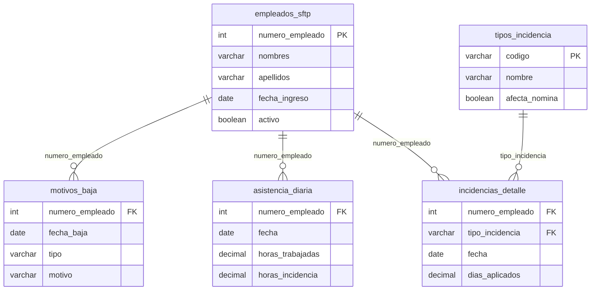

# 📋 Estructura Completa de Tablas - MRM Simple

**Fecha de generación:** 2025-09-15
**Proyecto:** HR KPI Dashboard
**Base de datos:** Supabase PostgreSQL

---

## 📊 Resumen General

| Tabla | Estado | Registros | Archivo SFTP Fuente | Propósito |
|-------|---------|-----------|-------------------|-----------|
| `empleados_sftp` | ✅ **EXISTE** | 106 | `Validacion Alta de empleados.xls` `Prenomina Horizontal.csv` | Datos maestros de empleados |
| `motivos_baja` | ✅ **EXISTE** | 9 | `MotivosBaja.csv` `Motivos_Bajas_SFTP.pdf` | Registro de bajas y terminaciones |
| `asistencia_diaria` | ✅ **EXISTE** | 0 | Datos calculados/importados | Control de asistencia diaria |
| `incidencias_detalle` | 🆕 **NUEVA** | 0 | `Incidencias_FI_FJ_SUS_PSG_PCG_INC_VAC_SFTP.pdf` | Incidencias específicas por empleado |
| `tipos_incidencia` | 🆕 **NUEVA** | 7 | Catálogo interno | Tipos de incidencias maestro |

---

## 🏢 1. Tabla: `empleados_sftp`

**Propósito:** Datos maestros de todos los empleados
**Fuente:** `Validacion Alta de empleados.xls`, `Prenomina Horizontal.csv`
**Registros actuales:** 106
**RLS:** ✅ Habilitado

### Estructura de Campos

| Campo | Tipo | Restricciones | Descripción |
|-------|------|---------------|-------------|
| `id` | `INTEGER` | PRIMARY KEY, AUTO INCREMENT | Identificador único interno |
| `numero_empleado` | `INTEGER` | NOT NULL, UNIQUE | Número de empleado (clave de negocio) |
| `apellidos` | `VARCHAR` | NOT NULL | Apellidos del empleado |
| `nombres` | `VARCHAR` | NOT NULL | Nombres del empleado |
| `nombre_completo` | `VARCHAR` | NULLABLE | Nombre completo concatenado |
| `gafete` | `VARCHAR` | NULLABLE | Número de gafete identificativo |
| `genero` | `VARCHAR` | NULLABLE | Género del empleado |
| `imss` | `VARCHAR` | NULLABLE | Número de seguridad social |
| `fecha_nacimiento` | `DATE` | NULLABLE | Fecha de nacimiento |
| `estado` | `VARCHAR` | NULLABLE | Estado de origen |
| `fecha_ingreso` | `DATE` | NOT NULL | Fecha de ingreso a la empresa |
| `fecha_antiguedad` | `DATE` | NULLABLE | Fecha para cálculo de antigüedad |
| `empresa` | `VARCHAR` | NULLABLE | Empresa o entidad |
| `registro_patronal` | `VARCHAR` | NULLABLE | Registro patronal IMSS |
| `codigo_puesto` | `VARCHAR` | NULLABLE | Código del puesto |
| `puesto` | `VARCHAR` | NULLABLE | Descripción del puesto |
| `codigo_depto` | `VARCHAR` | NULLABLE | Código del departamento |
| `departamento` | `VARCHAR` | NULLABLE | Nombre del departamento |
| `codigo_cc` | `VARCHAR` | NULLABLE | Código de centro de costos |
| `cc` | `VARCHAR` | NULLABLE | Centro de costos |
| `subcuenta_cc` | `VARCHAR` | NULLABLE | Subcuenta de centro de costos |
| `clasificacion` | `VARCHAR` | NULLABLE | Clasificación del empleado |
| `codigo_area` | `VARCHAR` | NULLABLE | Código del área |
| `area` | `VARCHAR` | NULLABLE | Área de trabajo |
| `ubicacion` | `VARCHAR` | NULLABLE | Ubicación física |
| `tipo_nomina` | `VARCHAR` | NULLABLE | Tipo de nómina |
| `turno` | `VARCHAR` | NULLABLE | Turno de trabajo |
| `prestacion_ley` | `VARCHAR` | NULLABLE | Prestaciones de ley |
| `paquete_prestaciones` | `VARCHAR` | NULLABLE | Paquete de prestaciones |
| `fecha_baja` | `DATE` | NULLABLE | Fecha de baja (si aplica) |
| `activo` | `BOOLEAN` | NOT NULL, DEFAULT TRUE | Estado activo del empleado |
| `fecha_creacion` | `TIMESTAMPTZ` | DEFAULT NOW() | Fecha de creación del registro |
| `fecha_actualizacion` | `TIMESTAMPTZ` | DEFAULT NOW() | Última actualización |

### Índices
- `PRIMARY KEY (id)`
- `UNIQUE (numero_empleado)`

---

## 📉 2. Tabla: `motivos_baja`

**Propósito:** Registro de bajas y terminaciones de empleados
**Fuente:** `MotivosBaja.csv`, `Motivos_Bajas_SFTP.pdf`
**Registros actuales:** 9
**RLS:** ✅ Habilitado

### Estructura de Campos

| Campo | Tipo | Restricciones | Descripción |
|-------|------|---------------|-------------|
| `id` | `INTEGER` | PRIMARY KEY, AUTO INCREMENT | Identificador único |
| `numero_empleado` | `INTEGER` | NOT NULL | Referencia al empleado |
| `fecha_baja` | `DATE` | NOT NULL | Fecha efectiva de la baja |
| `tipo` | `VARCHAR` | NOT NULL | Tipo de baja (renuncia, despido, etc.) |
| `motivo` | `VARCHAR` | NOT NULL | Motivo específico de la baja |
| `descripcion` | `TEXT` | NULLABLE | Descripción detallada |
| `observaciones` | `TEXT` | NULLABLE | Observaciones adicionales |
| `fecha_creacion` | `TIMESTAMPTZ` | DEFAULT NOW() | Fecha de creación del registro |

### Índices
- `PRIMARY KEY (id)`

---

## 📅 3. Tabla: `asistencia_diaria`

**Propósito:** Control diario de asistencia y horas trabajadas
**Fuente:** Datos calculados/importados
**Registros actuales:** 0 (sin datos aún)
**RLS:** ✅ Habilitado

### Estructura de Campos

| Campo | Tipo | Restricciones | Descripción |
|-------|------|---------------|-------------|
| `id` | `INTEGER` | PRIMARY KEY, AUTO INCREMENT | Identificador único |
| `numero_empleado` | `INTEGER` | NOT NULL | Referencia al empleado |
| `fecha` | `DATE` | NOT NULL | Fecha del registro de asistencia |
| `dia_semana` | `VARCHAR` | NULLABLE | Día de la semana |
| `horas_trabajadas` | `NUMERIC(4,2)` | DEFAULT 8.0 | Horas efectivamente trabajadas |
| `horas_incidencia` | `NUMERIC(4,2)` | DEFAULT 0.0 | Horas de incidencias |
| `presente` | `BOOLEAN` | DEFAULT TRUE | Si el empleado estuvo presente |
| `fecha_creacion` | `TIMESTAMPTZ` | DEFAULT NOW() | Fecha de creación del registro |

### Índices
- `PRIMARY KEY (id)`

---

## 🚨 4. Tabla: `incidencias_detalle` (NUEVA)

**Propósito:** Registro detallado de incidencias específicas por empleado
**Fuente:** `Incidencias_FI_FJ_SUS_PSG_PCG_INC_VAC_SFTP.pdf`
**Registros actuales:** 0 (tabla nueva)
**RLS:** ✅ Habilitado

### Estructura de Campos

| Campo | Tipo | Restricciones | Descripción |
|-------|------|---------------|-------------|
| `id` | `INTEGER` | PRIMARY KEY, AUTO INCREMENT | Identificador único |
| `numero_empleado` | `INTEGER` | NOT NULL | Referencia al empleado |
| `fecha` | `DATE` | NOT NULL | Fecha de la incidencia |
| `tipo_incidencia` | `VARCHAR(10)` | NOT NULL | Código del tipo (FI, FJ, SUS, PSG, PCG, INC, VAC) |
| `descripcion_tipo` | `VARCHAR(100)` | NULLABLE | Descripción completa del tipo |
| `dias_aplicados` | `DECIMAL(4,2)` | DEFAULT 1.0 | Días que aplica la incidencia |
| `observaciones` | `TEXT` | NULLABLE | Observaciones adicionales |
| `fecha_inicio` | `DATE` | NULLABLE | Fecha de inicio del periodo |
| `fecha_fin` | `DATE` | NULLABLE | Fecha de fin del periodo |
| `aprobado_por` | `VARCHAR(200)` | NULLABLE | Quien aprobó la incidencia |
| `folio_referencia` | `VARCHAR(50)` | NULLABLE | Folio de referencia |
| `monto_descuento` | `DECIMAL(10,2)` | DEFAULT 0.0 | Monto de descuento aplicado |
| `afecta_nomina` | `BOOLEAN` | DEFAULT TRUE | Si afecta el cálculo de nómina |
| `fecha_creacion` | `TIMESTAMPTZ` | DEFAULT NOW() | Fecha de creación |
| `fecha_actualizacion` | `TIMESTAMPTZ` | DEFAULT NOW() | Última actualización |

### Restricciones
- `UNIQUE(numero_empleado, fecha, tipo_incidencia)`
- `CHECK (tipo_incidencia IN ('FI', 'FJ', 'SUS', 'PSG', 'PCG', 'INC', 'VAC'))`
- `CHECK (dias_aplicados >= 0)`
- `CHECK (fecha_fin >= fecha_inicio OR fecha_fin IS NULL)`

### Índices
- `PRIMARY KEY (id)`
- `INDEX (numero_empleado)`
- `INDEX (fecha)`
- `INDEX (tipo_incidencia)`
- `INDEX (fecha_inicio, fecha_fin)`

---

## 📋 5. Tabla: `tipos_incidencia` (NUEVA)

**Propósito:** Catálogo maestro de tipos de incidencias
**Fuente:** Catálogo interno del sistema
**Registros iniciales:** 7 tipos predefinidos
**RLS:** ✅ Habilitado

### Estructura de Campos

| Campo | Tipo | Restricciones | Descripción |
|-------|------|---------------|-------------|
| `codigo` | `VARCHAR(10)` | PRIMARY KEY | Código único del tipo (FI, FJ, etc.) |
| `nombre` | `VARCHAR(100)` | NOT NULL | Nombre descriptivo |
| `descripcion` | `TEXT` | NULLABLE | Descripción completa |
| `afecta_asistencia` | `BOOLEAN` | DEFAULT TRUE | Si afecta el cálculo de asistencia |
| `afecta_nomina` | `BOOLEAN` | DEFAULT TRUE | Si afecta el cálculo de nómina |
| `requiere_aprobacion` | `BOOLEAN` | DEFAULT FALSE | Si requiere aprobación previa |
| `dias_maximos` | `INTEGER` | NULLABLE | Máximo de días permitidos |
| `color_hex` | `VARCHAR(7)` | DEFAULT '#6B7280' | Color para interfaz de usuario |
| `activo` | `BOOLEAN` | DEFAULT TRUE | Si el tipo está activo |
| `fecha_creacion` | `TIMESTAMPTZ` | DEFAULT NOW() | Fecha de creación |

### Datos Iniciales

| Código | Nombre | Descripción | Color |
|--------|--------|-------------|--------|
| `FI` | Falta Injustificada | Ausencia sin justificación válida | 🔴 #EF4444 |
| `FJ` | Falta Justificada | Ausencia con justificación válida | 🟡 #F59E0B |
| `SUS` | Suspensión | Suspensión disciplinaria | 🔴 #DC2626 |
| `PSG` | Permiso Sin Goce | Permiso sin goce de sueldo | 🟣 #9333EA |
| `PCG` | Permiso Con Goce | Permiso con goce de sueldo | 🟢 #10B981 |
| `INC` | Incapacidad | Incapacidad médica | 🔵 #3B82F6 |
| `VAC` | Vacaciones | Periodo vacacional | 🟦 #06B6D4 |

---

## 🔗 Relaciones entre Tablas

---

## 📊 Mapeo de Archivos SFTP a Tablas

| Archivo SFTP | Tabla Destino | Estado | Observaciones |
|--------------|---------------|---------|---------------|
| `Validacion Alta de empleados.xls` | `empleados_sftp` | ✅ **ACTIVO** | Datos maestros principales |
| `Prenomina Horizontal.csv` | `empleados_sftp` | ✅ **ACTIVO** | Datos complementarios |
| `MotivosBaja.csv` | `motivos_baja` | ✅ **ACTIVO** | Bajas actualizadas |
| `Motivos_Bajas_SFTP.pdf` | `motivos_baja` | ⚠️ **PENDIENTE** | Requiere procesamiento PDF |
| `Incidencias_FI_FJ_SUS_PSG_PCG_INC_VAC_SFTP.pdf` | `incidencias_detalle` | 🆕 **NUEVA TABLA** | Requiere procesamiento PDF |

---

## 🚀 Siguientes Pasos

1. **✅ COMPLETADO:** Análisis de estructura actual
2. **✅ COMPLETADO:** Identificación de tablas faltantes
3. **✅ COMPLETADO:** Creación de script SQL (`CREATE_MISSING_TABLES.sql`)
4. **📋 PENDIENTE:** Ejecutar script SQL en Supabase
5. **📋 PENDIENTE:** Implementar procesamiento de archivos PDF
6. **📋 PENDIENTE:** Actualizar APIs de importación
7. **📋 PENDIENTE:** Verificar importación completa de datos

---

## 💡 Notas Técnicas

- **RLS habilitado** en todas las tablas para seguridad
- **Índices optimizados** para consultas frecuentes por empleado y fecha
- **Catálogo de tipos** permite extensibilidad futura
- **Campos de auditoría** en todas las tablas principales
- **Restricciones de integridad** para garantizar calidad de datos

---

**Generado automáticamente por Claude Code**
*Última actualización: 2025-09-15*